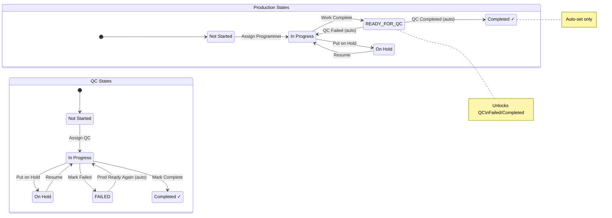

# Tracker Workflow Documentation

This document describes the complete workflow for Production and QC status transitions, including auto-triggers and validation rules.

## Status Flow Overview

```
┌─────────────────────────────────────────────────────────────────────────────────┐
│                           PRODUCTION WORKFLOW                                    │
├─────────────────────────────────────────────────────────────────────────────────┤
│                                                                                  │
│   ┌──────────────┐      ┌──────────────┐      ┌──────────────┐                  │
│   │  NOT_STARTED │ ───► │  IN_PROGRESS │ ───► │ READY_FOR_QC │                  │
│   └──────────────┘      └──────────────┘      └──────────────┘                  │
│          │                     ▲                     │                           │
│          │                     │                     │                           │
│          ▼                     │                     ▼                           │
│   ┌──────────────┐             │              ┌──────────────┐                  │
│   │   ON_HOLD    │ ◄───────────┼──────────────│  COMPLETED   │ ◄── AUTO ONLY   │
│   └──────────────┘             │              └──────────────┘                  │
│          │                     │                     ▲                           │
│          └─────────────────────┘                     │                           │
│                                                      │                           │
│   🔒 COMPLETED cannot be set manually               │                           │
│      Only auto-triggered by QC completion ──────────┘                           │
│                                                                                  │
└─────────────────────────────────────────────────────────────────────────────────┘

┌─────────────────────────────────────────────────────────────────────────────────┐
│                              QC WORKFLOW                                         │
├─────────────────────────────────────────────────────────────────────────────────┤
│                                                                                  │
│   ┌──────────────┐      ┌──────────────┐                                        │
│   │  NOT_STARTED │ ───► │  IN_PROGRESS │ ◄─────────────────────┐               │
│   └──────────────┘      └──────────────┘                       │               │
│          │                     │                               │               │
│          ▼                     │                               │               │
│   ┌──────────────┐             │                               │               │
│   │   ON_HOLD    │ ◄───────────┤                               │               │
│   └──────────────┘             │                               │               │
│                                │                               │               │
│                                ▼                               │               │
│                    ┌─────────────────────┐                     │               │
│                    │ Production must be  │                     │               │
│                    │   READY_FOR_QC      │                     │               │
│                    └─────────────────────┘                     │               │
│                          │         │                           │               │
│                          ▼         ▼                           │               │
│                   ┌──────────┐ ┌──────────┐                    │               │
│                   │  FAILED  │ │COMPLETED │                    │               │
│                   └──────────┘ └──────────┘                    │               │
│                          │           │                         │               │
│                          │           │                         │               │
│                          ▼           │                         │               │
│                   Auto-trigger:      │                         │               │
│                   Prod→IN_PROGRESS ──┘                         │               │
│                                                                │               │
│   🔒 FAILED/COMPLETED only when Prod = READY_FOR_QC           │               │
│                                                                                  │
└─────────────────────────────────────────────────────────────────────────────────┘
```

## Detailed State Machine



## Auto-Trigger Rules

### Rule 1: QC Completed → Production Completed
```
┌─────────────────────────────────────────────────────────────┐
│  TRIGGER: QC Status changed to COMPLETED                    │
├─────────────────────────────────────────────────────────────┤
│  Precondition: Production = READY_FOR_QC                    │
│                                                             │
│  AUTO ACTION:                                               │
│  ┌─────────────────┐       ┌─────────────────┐             │
│  │ QC: COMPLETED   │  ───► │ Prod: COMPLETED │             │
│  └─────────────────┘       └─────────────────┘             │
│                                                             │
│  Result: Both Production and QC are now COMPLETED           │
│          "In Production" flag can now be toggled            │
└─────────────────────────────────────────────────────────────┘
```

### Rule 2: QC Failed → Production Back to In Progress
```
┌─────────────────────────────────────────────────────────────┐
│  TRIGGER: QC Status changed to FAILED                       │
├─────────────────────────────────────────────────────────────┤
│  Precondition: Production = READY_FOR_QC                    │
│                                                             │
│  AUTO ACTION:                                               │
│  ┌─────────────────┐       ┌─────────────────┐             │
│  │ QC: FAILED      │  ───► │ Prod: IN_PROGRESS│             │
│  └─────────────────┘       └─────────────────┘             │
│                                                             │
│  Result: Production programmer must fix and resubmit        │
│          QC comment explains the failure reason             │
└─────────────────────────────────────────────────────────────┘
```

### Rule 3: Production Ready for QC (After Failure) → QC In Progress
```
┌─────────────────────────────────────────────────────────────┐
│  TRIGGER: Production Status changed to READY_FOR_QC         │
├─────────────────────────────────────────────────────────────┤
│  Precondition: QC = FAILED                                  │
│                                                             │
│  AUTO ACTION:                                               │
│  ┌─────────────────┐       ┌─────────────────┐             │
│  │ Prod: READY_QC  │  ───► │ QC: IN_PROGRESS │             │
│  └─────────────────┘       └─────────────────┘             │
│                                                             │
│  Result: QC programmer can now re-review the work           │
└─────────────────────────────────────────────────────────────┘
```

### Rule 4: Reopening Completed Work
```
┌─────────────────────────────────────────────────────────────┐
│  TRIGGER: Production Status changed from COMPLETED          │
│           to IN_PROGRESS                                    │
├─────────────────────────────────────────────────────────────┤
│  Precondition: Production = COMPLETED                       │
│                                                             │
│  AUTO ACTIONS:                                              │
│  ┌─────────────────┐       ┌─────────────────┐             │
│  │ Prod: IN_PROG   │  ───► │ QC: IN_PROGRESS │             │
│  └─────────────────┘       └─────────────────┘             │
│                            ┌─────────────────┐             │
│                       ───► │ In_Prod: FALSE  │             │
│                            └─────────────────┘             │
│                                                             │
│  Result: Work reopened, In Production flag cleared          │
└─────────────────────────────────────────────────────────────┘
```

## Validation Rules

### Production Status Restrictions

| Current Status | Allowed Manual Transitions | Blocked |
|---------------|---------------------------|---------|
| NOT_STARTED | IN_PROGRESS, ON_HOLD | COMPLETED |
| IN_PROGRESS | READY_FOR_QC, ON_HOLD, NOT_STARTED | COMPLETED |
| READY_FOR_QC | IN_PROGRESS, ON_HOLD, NOT_STARTED | COMPLETED |
| ON_HOLD | IN_PROGRESS, NOT_STARTED | COMPLETED |
| COMPLETED | IN_PROGRESS (reopens work) | - |

> ⚠️ **COMPLETED can NEVER be set manually** - only via QC completion auto-trigger

### QC Status Restrictions

| Current Status | Allowed (Prod = READY_FOR_QC) | Allowed (Prod ≠ READY_FOR_QC) |
|---------------|------------------------------|-------------------------------|
| NOT_STARTED | IN_PROGRESS, ON_HOLD | IN_PROGRESS, ON_HOLD |
| IN_PROGRESS | FAILED, COMPLETED, ON_HOLD | ON_HOLD, NOT_STARTED |
| ON_HOLD | IN_PROGRESS | IN_PROGRESS |
| FAILED | IN_PROGRESS | IN_PROGRESS |
| COMPLETED | - | - |

> ⚠️ **FAILED/COMPLETED only when Production = READY_FOR_QC**

### Additional Validation Rules

1. **Programmer Assignment Required**
   - Cannot change production status (except NOT_STARTED) without production programmer assigned
   - Cannot change QC status (except NOT_STARTED) without QC programmer assigned

2. **Unresolved Comments Block QC Completion**
   - QC cannot be marked COMPLETED if there are unresolved comments
   - All comments must be resolved first

3. **In Production Flag**
   - Can only be set to TRUE when both Production AND QC are COMPLETED
   - Automatically set to FALSE when work is reopened

## Complete Lifecycle Example

```
┌────────────────────────────────────────────────────────────────────────────────┐
│                        TYPICAL ITEM LIFECYCLE                                   │
├────────────────────────────────────────────────────────────────────────────────┤
│                                                                                 │
│  1. ITEM CREATED                                                               │
│     ├── Production: NOT_STARTED                                                │
│     └── QC: NOT_STARTED                                                        │
│                                                                                 │
│  2. ASSIGN PRODUCTION PROGRAMMER                                               │
│     ├── Production: IN_PROGRESS (auto when programmer assigned)                │
│     └── QC: NOT_STARTED                                                        │
│                                                                                 │
│  3. PRODUCTION WORK COMPLETE                                                   │
│     ├── Production: READY_FOR_QC ✓                                             │
│     └── QC: NOT_STARTED                                                        │
│                                                                                 │
│  4. ASSIGN QC PROGRAMMER                                                       │
│     ├── Production: READY_FOR_QC                                               │
│     └── QC: IN_PROGRESS ✓                                                      │
│                                                                                 │
│  5a. QC PASSES                               5b. QC FAILS                      │
│      ├── QC: COMPLETED ✓                         ├── QC: FAILED ✓              │
│      └── Production: COMPLETED (auto) ✓          └── Production: IN_PROGRESS   │
│                                                       (auto - back to fix)     │
│                                                                                 │
│  6. (After 5b) FIXES MADE, RESUBMIT                                           │
│     ├── Production: READY_FOR_QC ✓                                             │
│     └── QC: IN_PROGRESS (auto)                                                 │
│                                                                                 │
│  7. QC PASSES (2nd attempt)                                                    │
│     ├── QC: COMPLETED ✓                                                        │
│     └── Production: COMPLETED (auto) ✓                                         │
│                                                                                 │
│  8. MARK AS IN PRODUCTION                                                      │
│     └── in_production_flag: TRUE ✓                                             │
│                                                                                 │
│  ════════════════════════════════════════════════════════════════════════════  │
│                              ✅ WORKFLOW COMPLETE                               │
└────────────────────────────────────────────────────────────────────────────────┘
```

## Visual Flow Diagram

```
                                    PRODUCTION                                              QC
                                    ══════════                                          ════════
                                         │                                                  │
                                         ▼                                                  ▼
                               ┌─────────────────┐                               ┌─────────────────┐
                               │   NOT_STARTED   │                               │   NOT_STARTED   │
                               └────────┬────────┘                               └────────┬────────┘
                                        │                                                 │
                          Assign Programmer                                    Assign QC Programmer
                                        │                                                 │
                                        ▼                                                 ▼
                    ┌──────────────────────────────────┐               ┌──────────────────────────────────┐
                    │           IN_PROGRESS            │◄──────────────│           IN_PROGRESS            │
                    └──────────────────┬───────────────┘   QC FAILED   └────────────────┬─────────────────┘
                                       │                   (auto)                       │
                         Work Complete │                                                │
                                       │                                                │
                                       ▼                                                │
                               ┌───────────────┐                                        │
                       ┌───────│  READY_FOR_QC │────────────────────────────────────────┤
                       │       └───────────────┘                                        │
                       │                                                                │
                       │                               Only when Prod = READY_FOR_QC    │
                       │                                         │                      │
                       │                                         ▼                      │
                       │                            ┌───────────────────────┐           │
                       │                            │  FAILED or COMPLETED  │◄──────────┘
                       │                            └───────────┬───────────┘
                       │                                        │
                       │                              QC COMPLETED
                       │                                   (auto)
                       ▼                                        │
               ┌───────────────┐                                │
               │   COMPLETED   │◄───────────────────────────────┘
               │   (auto only) │
               └───────────────┘
                       │
                       │ Both Complete?
                       ▼
               ┌───────────────┐
               │ IN_PRODUCTION │
               │     FLAG      │
               └───────────────┘
```

## Permission Matrix

| Action | Admin | Lead | Editor (assigned) | Editor (not assigned) | Viewer |
|--------|-------|------|-------------------|----------------------|--------|
| Change Production Status | ✅ | ✅ | ✅ | ❌ | ❌ |
| Change QC Status | ✅ | ✅ | ✅ | ❌ | ❌ |
| Toggle In Production Flag | ✅ | ✅ | ✅ | ❌ | ❌ |
| Assign Programmers | ✅ | ✅ | ❌ | ❌ | ❌ |
| View Tracker | ✅ | ✅ | ✅ | ✅ | ✅ |

---

*Last Updated: January 2026*

